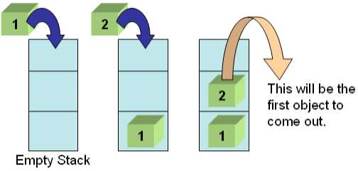

# Stacks
When we think about stacks we should be picturing a deck of cards, a stack of dirty plates and even pancakes as they are usually served one on top of the other. A very important concept to understand when learning stacks is the LIFO style which means " Last-In-First-Out".<br>
<br><br>
In the picture above we can see a stack of pancakes with different colors, if we think about it, the very last pancake to be place in the plate was the green one. Once is serve to you, it will be the first one you will eat as it is on top, hence the LIFO style. The big O notation of stack operations is O(1).

## Creating a Stack:
In C# we can create an object of a stack by typing Stack<>, we need to specify a type of paramenter inside the braces for the type of slements that the stack will store. It can be numbers, letters, words and much more. In order to add new elements in the stack we use the Push() method and stack does allow null and duplicate values.<br>
```
Stack<int> myStack = new Stack<int>();
myStack.Push(1)
myStack.Push(2)
myStack.Push(3)
myStack.Push(4)
foreach (var item in myStack)
    Console.Write(item + ",")// prints 4,3,2,1
```
We can also create a Stack from an array:

```
string[] arr = new string[]{ monday,tuesday,wednesday,friday};
Stack<string> myStack = new Stack<string>(arr);

foreach (var item in myStack)
     Console.Write(item + ","); //prints monday,tuesday,wednesday,friday
```
## The Pop() method
The Pop() method will remove the last element from the stack. If the stack is empty there will be a return error "InvalidOperationExeption" so it is always a good idea to check the number of elements in a stack.
```
Stack<int> pancakes = new Stack<int>();
pancakes.Push(1);
pancakes.Push(2);
pancakes.Push(3);
pancakes.Push(4);
while (pancakes.Count > 2)
    Console.Write(pancakes.Pop() + ",")
    // it prints 4,3,
```

## Example: Washing plates
So in this example we start with an empty stack and then plate number one is push into the stack. Plate number 2 is also push into the stack in top of the number one, subsequently we will be ble to push multiple plates into the stack. But the last one to be push in will be the last one to be "pop" out like in the example. 
<br><br>

```
    // Creating a Stack of strings
    Stack<string> myStack = new Stack<string>();

    // Inserting the elements into the Stack
    myStack.Push("Plate number 1");
    myStack.Push("Plate number 2");
    myStack.Push("Plate number 3");
    

    // Displaying the count of elements
    // contained in the Stack
    Console.Write("Total number of elements in the Stack are : ");
    Console.WriteLine(myStack.Count);
    //Will print out 3

    // Displaying the top element of Stack
    // without removing it from the Stack
    Console.WriteLine("Element at the top is : " + myStack.Peek());
    //Will print out "Plate number 3"
 ``` 
## Problem To Solve : Reversing a word using stacks
<br><br>

In this problem you will create an empty stack. Then you will have to convert strings into characters and place then into the empty stack, then you will have to pop them back up into a character array and convert the characters back into a string.<br>
[Solution](https://github.com/learrieta/Final-Project/blob/master/solutions/reverseWord.md)

