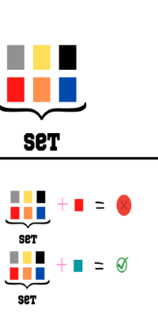

# Sets
When we think about sets the first word that should come to mind is "unique". Unlike stacks from the last module, sets are a collection of items or data that constains no duplicate elements. Another main difference between sets and stacks is that order does not matter in sets. <br>
<br><br>
In the picture above we can see a set of colors. Below the set we see what would happen if we try to add a color that already exists inside the set, it would not work as each element in the set has to be unique. But when we tried to add the teal color, it worked as the set did not already had teal. The big O notation for HashSets is O(1)

## Creating a HashSet:
We can create a HashSet by typing HashSet<> we need to specify a type of paramenter inside the braces for the type of slements that the hashset will store. We then name it and we equal it to new Hashset<>().
```
 HashsSet<int> sets = new HashSet<int>();
 sets.Add(5);
 sets.Add(4);
 sets.Add(3);
 sets.Add(2);
 sets.Add(1);
 foreach( int i in sets){
    Console.Write( i + " ") // Will print 5,4,3,2,1
 }
```
## The SortedSet:
If we wanted to create an order set, instead of typing HashSet, we would type SortedSet, which will make the set ordered.
```
SortedSet<int> my_Set1 = new SortedSet<int>();
    my_Set1.Add(101);
    my_Set1.Add(1001);
    my_Set1.Add(10001);
    my_Set1.Add(100001);

    foreach(var val in my_Set1)
    {
        Console.WriteLine(val); // will print 101,1001,10001,100001
    }
```

## The Contains() Method:
The contain method basically determines if there is a value in the set. The method will return true is they elements is present:
```
SortedSet<string> letters = new SortedSet<string>();

    my_Set.Add("hola");
    my_Set.Add("soy");
    my_Set.Add("dora");

    if (my_Set.Contains("dora") == true)
    {
        Console.WriteLine("Element is available..!");
    }

    else
    {
        Console.WriteLine("Element is not available..!");
    }
```

## Example : Adding duplicate songs in a playlist:
In this example we have a playlist with different song names, but towards the end we see that the system is trying to add another song with the name "Song 2" which it already exists, lets see what happens!<br>
<br><br>
```
SortedSet <string> playlist = SortedSet<string>();

playlist.Add("Song1");
playlist.Add("Song2");
playlist.Add("Song3");
playlist.Add("Song4");

#Then:
playlist.Add("Song2")

Console.Write("The number of songs in my playlist is : playlist.Count) /// It will printout 4 as the last song was already in the set and was not added to it again.
```

## Problem to Solve :  Uniting to HashSets
<br><br>
In the following code you will create 2 different sets, one will contain a name and one a last name, then we will try to add them together. Try to print out the name "Joseph Smith" using two different sets.<br>
[Solution](https://github.com/learrieta/Solutions.git)


