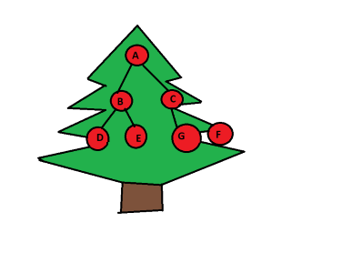
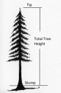
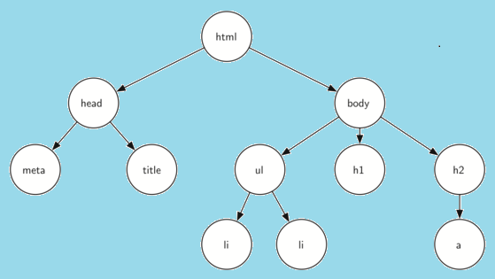

# Trees
A tree in a data structure is a hierarchical structure in the for of a tree. These trees are composed of nodes and each node has a data and a reference. The top node in a tree is called the Root Node or Parent Node and the nodes underath it are refer to as the right subtree and left subtree. The reason for using trees is that is very space efficient. The big O notation of a tree is O(1).<br>
<br><br>
In the above beautiful christmas tree we can see that the root parent is the A as is the top ornament. In the left side there is the "left subtree" with the new parent node being B and the children being D & E. The same case is apply to the right side with the "right subtree" with the new parent being C and the children being G & F. A tree data structure is not considered a linear data structure, instead they are arrange on multiple levels with the Root Node being level 0.<br>

# Basic Operations of a tree:
## Create:
In order to create a basic tree structure, we need to create a class called node in which we will store int type variables key, lefts(left node) and rights(right node).
```
public class Node{
public int key;
public node lefts, rights;

// Constructor
public Node(int key)
{
    this.key = key;
    lefts = null;
    rights = null
}
};
```
## Insert:
```
 static void insert(Node temp, int key)
{
    if (temp == null) 
    {
        root = new Node(key);
        return;
    }
    Queue<Node> q = new Queue<Node>();
    q.Enqueue(temp);

    // Do level order traversal until we find
    // an empty place.
    while (q.Count != 0) {
        temp = q.Peek();
        q.Dequeue();

        if (temp.lefts == null) {
            temp.lefts = new Node(key);
            break;
        }
        else
            q.Enqueue(temp.lefts);

        if (temp.rights == null) {
            temp.rights = new Node(key);
            break;
        }
        else
            q.Enqueue(temp.rights);
    }
}
```
## Example: Get the height of a binary tree
The height of a tree is the number of edges in the tree from the root to the very last node. Consequently the height of an empty tree will be 0. In this example we will use recursion to calculate the height of the left ans right subtree.<br>
<br><br>
```
public class Node {
    public int data;
    public Node left, right;
  
    public Node(int item)
    {
        data = item;
        left = right = null;
    }
}
  
public class BinaryTree {
    Node root;
    int maxDepth(Node node)
    {
        if (node == null)
            return 0;
        else {
            /* compute the depth of each subtree */
            int lDepth = maxDepth(node.left);
            int rDepth = maxDepth(node.right);
  
            /* use the larger one */
            if (lDepth > rDepth)
                return (lDepth + 1);
            else
                return (rDepth + 1);
        }
    }
  
    public static void Main(String[] args)
    {
        BinaryTree tree = new BinaryTree();
  
        tree.root = new Node(1);
        tree.root.left = new Node(2);
        tree.root.right = new Node(3);
        tree.root.left.left = new Node(4);
        tree.root.left.right = new Node(5);
        tree.root.left.left.left = new Node(6);
  
        Console.WriteLine("Height of tree is " + tree.maxDep(tree.root)); // Height is 4
    }
}
```
## Problem to Solve: Print left nodes of this html tree.
<br><br>
For this problem you will need to use recursion. You will have to keep track of the left node level by passing the level as a parameter to the recursive calls. So at the ned of your code, it should print head, meta,ul and li<br>
[Solution](https://github.com/learrieta/Solutions.git)


